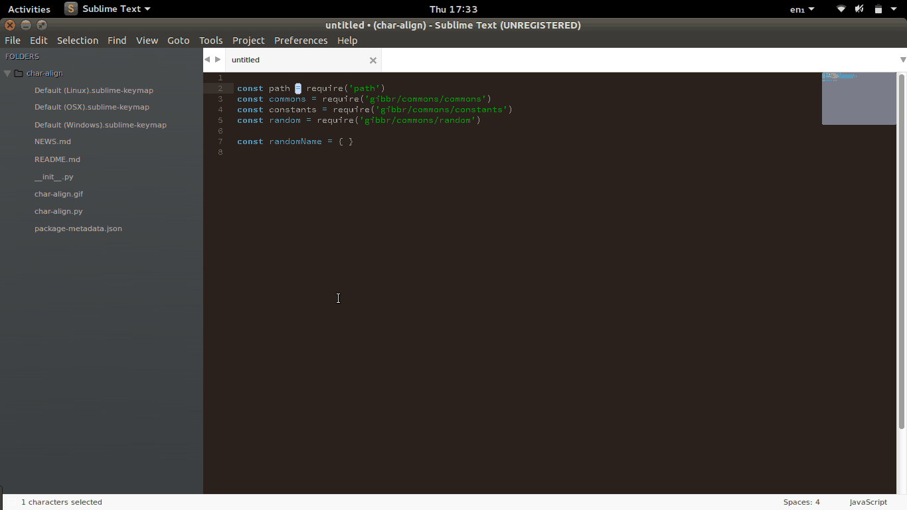

# Char-Align v0.1.0



## Installation

## Ubuntu / Linux

```bash
cd ~/.config/sublime-text-3/Packages                   && \
rm -rf char-align || true                              && \
git clone https://github.com/rgrannell1/char-align.git && \
cd -
```
## Windows

## OS-X

## Shortcuts

## License

## Versioning

